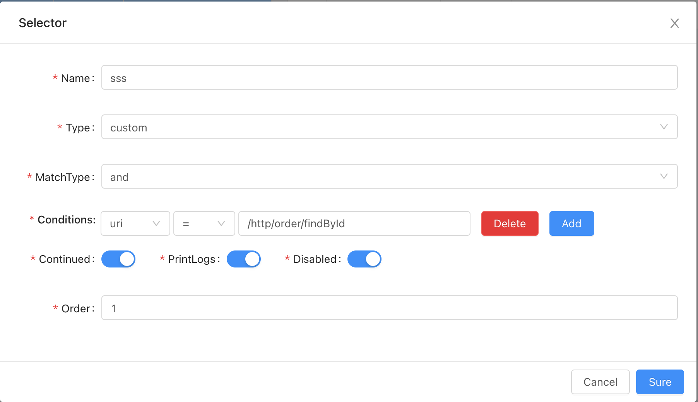
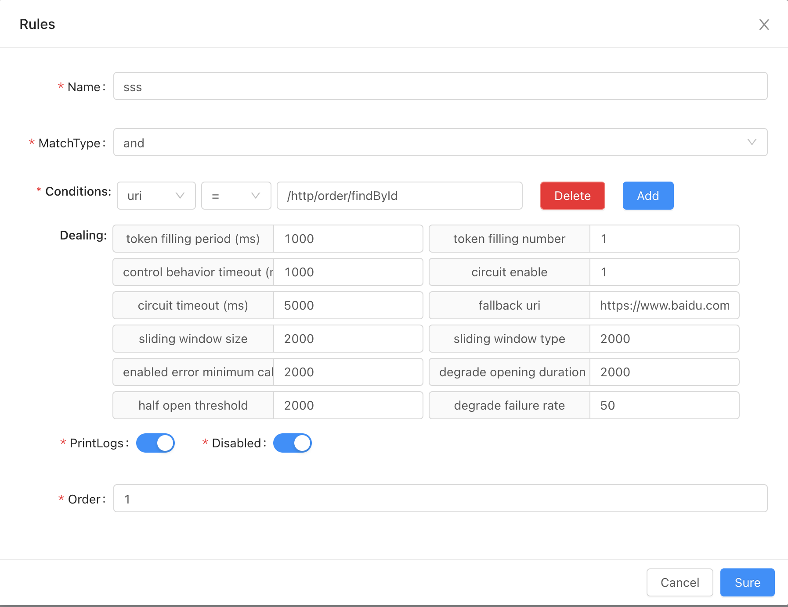

## Soul：resilence4j熔断插件原理分析

Soul网关不仅仅要对后端服务提供代理转发和灰度等基本功能，还要在网关层完成限流和熔断功能。

### Resilence4j配置

首先开启Resilence4j插件，之后如图所示配置selector和rule数据，这里url配置的都是/http/order/findById。




resilience规则的参数设置为，熔断模式，熔断超时5s，时间窗口2s，熔断异常比例50%。

通过client发送请求，可以看到经过了Hystrix逻辑。经过压测，1000tps，1000000次请求可以看到熔断器被开启。压测结果如下

```java
wrk -c 1000 -d 600 -t 1000 http://localhost:9195/http/order/findById
    Running 10m test @ http://localhost:9195/http/order/findById
    1000 threads and 1000 connections
^C  Thread Stats   Avg      Stdev     Max   +/- Stdev
    Latency   802.00ms  416.91ms   2.00s    66.51%
    Req/Sec     1.36      2.12    30.00     90.78%
    184315 requests in 2.69m, 27.96MB read
    Socket errors: connect 0, read 157, write 0, timeout 3693
    Non-2xx or 3xx responses: 184315
Requests/sec:   1143.97
Transfer/sec:    177.73KB
```
可以看到已经熔断。


### Resilience4j插件熔断原理

通过观察调用链，请求进来会首先经过GlobalPlugin。GlobalPlugin根据请求信息生成SoulContext，生成时DefaultSoulContextBuilder会截短url，生成realUrl和其他http相关信息放到SoulContext中。

```java
public class GlobalPlugin implements SoulPlugin {
    @Override
    public Mono<Void> execute(final ServerWebExchange exchange, final SoulPluginChain chain) {
        final ServerHttpRequest request = exchange.getRequest();
        final HttpHeaders headers = request.getHeaders();
        final String upgrade = headers.getFirst("Upgrade");
        SoulContext soulContext;
        if (StringUtils.isBlank(upgrade) || !"websocket".equals(upgrade)) {
            soulContext = builder.build(exchange);
        } else {
            final MultiValueMap<String, String> queryParams = request.getQueryParams();
            soulContext = transformMap(queryParams);
        }
        exchange.getAttributes().put(Constants.CONTEXT, soulContext);
        return chain.execute(exchange);
    }
}
```

```java
public class DefaultSoulContextBuilder implements SoulContextBuilder {
    
    @Override
    public SoulContext build(final ServerWebExchange exchange) {
        final ServerHttpRequest request = exchange.getRequest();
        String path = request.getURI().getPath();
        MetaData metaData = MetaDataCache.getInstance().obtain(path);
        if (Objects.nonNull(metaData) && metaData.getEnabled()) {
            exchange.getAttributes().put(Constants.META_DATA, metaData);
        }
        return transform(request, metaData);
    }
    
    private SoulContext transform(final ServerHttpRequest request, final MetaData metaData) {
        final String appKey = request.getHeaders().getFirst(Constants.APP_KEY);
        final String sign = request.getHeaders().getFirst(Constants.SIGN);
        final String timestamp = request.getHeaders().getFirst(Constants.TIMESTAMP);
        SoulContext soulContext = new SoulContext();
        String path = request.getURI().getPath();
        soulContext.setPath(path);
        if (Objects.nonNull(metaData) && metaData.getEnabled()) {
            if (RpcTypeEnum.SPRING_CLOUD.getName().equals(metaData.getRpcType())) {
                setSoulContextByHttp(soulContext, path);
                soulContext.setRpcType(metaData.getRpcType());
            } else if (RpcTypeEnum.DUBBO.getName().equals(metaData.getRpcType())) {
                setSoulContextByDubbo(soulContext, metaData);
            } else if (RpcTypeEnum.SOFA.getName().equals(metaData.getRpcType())) {
                setSoulContextBySofa(soulContext, metaData);
            } else if (RpcTypeEnum.TARS.getName().equals(metaData.getRpcType())) {
                setSoulContextByTars(soulContext, metaData);
            } else {
                setSoulContextByHttp(soulContext, path);
                soulContext.setRpcType(RpcTypeEnum.HTTP.getName());
            }
        } else {
            setSoulContextByHttp(soulContext, path);
            soulContext.setRpcType(RpcTypeEnum.HTTP.getName());
        }
        soulContext.setAppKey(appKey);
        soulContext.setSign(sign);
        soulContext.setTimestamp(timestamp);
        soulContext.setStartDateTime(LocalDateTime.now());
        Optional.ofNullable(request.getMethod()).ifPresent(httpMethod -> soulContext.setHttpMethod(httpMethod.name()));
        return soulContext;
    }
    
    private void setSoulContextByHttp(final SoulContext soulContext, final String path) {
        String contextPath = "/";
        String[] splitList = StringUtils.split(path, "/");
        if (splitList.length != 0) {
            contextPath = contextPath.concat(splitList[0]);
        }
        String realUrl = path.substring(contextPath.length());
        soulContext.setContextPath(contextPath);
        soulContext.setModule(contextPath);
        soulContext.setMethod(realUrl);
        soulContext.setRealUrl(realUrl);
    }
}
```

在AbstractSoulPlugin中获取到selector和rule信息后，调用Resilience4j插件的执行方法。

```java
	@Override
    protected Mono<Void> doExecute(final ServerWebExchange exchange, final SoulPluginChain chain, final SelectorData selector, final RuleData rule) {
        final SoulContext soulContext = exchange.getAttribute(Constants.CONTEXT);
        assert soulContext != null;
        Resilience4JHandle resilience4JHandle = GsonUtils.getGson().fromJson(rule.getHandle(), Resilience4JHandle.class);
        if (resilience4JHandle.getCircuitEnable() == 1) {
            return combined(exchange, chain, rule);
        }
        return rateLimiter(exchange, chain, rule);
    }

    private Mono<Void> rateLimiter(final ServerWebExchange exchange, final SoulPluginChain chain, final RuleData rule) {
        return ratelimiterExecutor.run(
                chain.execute(exchange), fallback(ratelimiterExecutor, exchange, null), Resilience4JBuilder.build(rule))
                .onErrorResume(throwable -> ratelimiterExecutor.withoutFallback(exchange, throwable));
    }

    private Mono<Void> combined(final ServerWebExchange exchange, final SoulPluginChain chain, final RuleData rule) {
        Resilience4JConf conf = Resilience4JBuilder.build(rule);
        return combinedExecutor.run(
                chain.execute(exchange).doOnSuccess(v -> {
                    if (exchange.getResponse().getStatusCode() != HttpStatus.OK) {
                        HttpStatus status = exchange.getResponse().getStatusCode();
                        exchange.getResponse().setStatusCode(null);
                        throw new CircuitBreakerStatusCodeException(status);
                    }
                }), fallback(combinedExecutor, exchange, conf.getFallBackUri()), conf);
    }
```

可以看到，执行代码中判断，如果是熔断模式就进入combined方法，否则就进入ratelimiter方法。combined方法中，通过Resilience4jBuilder构建出了Resilience4JConf对象。然后通过CombinedExecutor执行熔断判断逻辑。

```java
    @Override
    public <T> Mono<T> run(final Mono<T> run, final Function<Throwable, Mono<T>> fallback, final Resilience4JConf resilience4JConf) {
        RateLimiter rateLimiter = Resilience4JRegistryFactory.rateLimiter(resilience4JConf.getId(), resilience4JConf.getRateLimiterConfig());
        CircuitBreaker circuitBreaker = Resilience4JRegistryFactory.circuitBreaker(resilience4JConf.getId(), resilience4JConf.getCircuitBreakerConfig());
        Mono<T> to = run.transformDeferred(CircuitBreakerOperator.of(circuitBreaker))
                .transformDeferred(RateLimiterOperator.of(rateLimiter))
                .timeout(resilience4JConf.getTimeLimiterConfig().getTimeoutDuration())
                .doOnError(TimeoutException.class, t -> circuitBreaker.onError(
                        resilience4JConf.getTimeLimiterConfig().getTimeoutDuration().toMillis(),
                        TimeUnit.MILLISECONDS,
                        t));
        if (fallback != null) {
            to = to.onErrorResume(fallback);
        }
        return to;
    }
```
首先构建出了RateLimiter和CircuitBreaker对象，然后进入到了resilience4j的熔断逻辑中，最终返回是否熔断的结果。

和Hystrix相比，resilience更轻量，依赖于函数式编程。Hystrix采用面向对象的设计，其中对外部系统的调用必须包含在HystrixCommand提供多种功能中，但Resilience4J依赖于函数组合来让用户堆叠所需的特定装饰器。